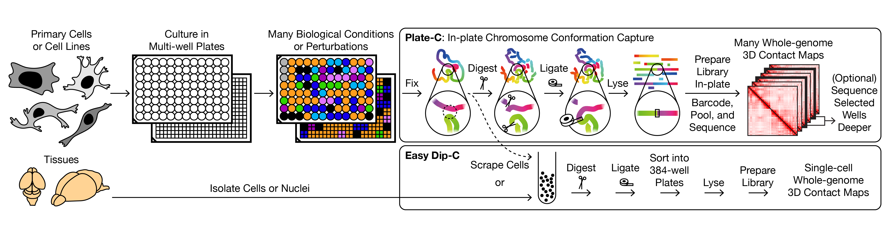
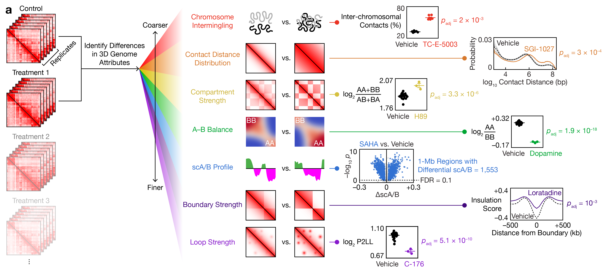

# Plate-C

Code for **"Whole-genome 3D architectural screen reveals cell type–dependent modulators of brain DNA structure"** (Parasar *et al.*).



**Plate-C** ("in-plate chromosome conformation capture") is a high-throughput, cost-effective Hi-C platform. Cells are cultured in 96- or 384-well plates, perturbed, and processed in-plate through a workflow that combines Hi-C (fixation, digestion, ligation) with library preparation (lysis, transposition, barcoded amplification), without biotin pull-down or bead transfers. The companion single-cell method **Easy Dip-C** applies the same chemistry to individual nuclei sorted into 384-well plates.

This repository holds the analysis code for the **7 attributes of genome architecture** quantified in Fig. 2a. Each attribute has its own folder.



| Folder | Attribute | Per-replicate measure | Main tools |
| --- | --- | --- | --- |
| [`01_chromosome_intermingling`](01_chromosome_intermingling) | Chromosome intermingling | % interchromosomal contacts | Python |
| [`02_contact_distance_distribution`](02_contact_distance_distribution) | Contact distance distribution | log10 contact-distance histogram | Python |
| [`03_compartment_strength`](03_compartment_strength) | Compartment strength | log2[(AA + BB)/(AB + BA)] | cooler, cooltools |
| [`04_ab_difference`](04_ab_difference) | A–B difference | log2(AA/BB) | cooler, cooltools |
| [`05_scab_profile`](05_scab_profile) | Locus-level scA/B profile (1-Mb) | scA/B per 1-Mb locus | dip-c, MATLAB |
| [`06_boundary_strength`](06_boundary_strength) | Boundary strength | mean log2 insulation score at TAD boundaries | cooltools, HiCExplorer |
| [`07_loop_strength`](07_loop_strength) | Loop strength | P2LL (peak-to-lower-left) | cooltools, coolpuppy |
| [`common`](common) | Upstream pipeline (reads → contacts), cooler preprocessing, shared statistics | – | BWA, hickit, dip-c, cooler, Python |

Supporting folders: `analyze_rna/` (bulk and 10x RNA-seq: DESeq2, Seurat, MATLAB plotting) and `plot_contact_maps/` (scA/B track plots).

For each attribute, every treatment's technical replicates are compared with the vehicle replicates of the same experiment by a two-sided, equal-variance *t*-test, and p-values are corrected across treatments with Benjamini–Hochberg (`common/compare_to_vehicle.py`; MATLAB `ttest2` + `mafdr` for scA/B loci).

---

## 1. System requirements

**Operating systems.** macOS (analysis notebooks, MATLAB) and Linux (Stanford Sherlock SLURM cluster for alignment, contact extraction and matrix building). The demo was tested on Linux with Python 3.13.

**Software**

| Component | Version | Used for |
| --- | --- | --- |
| Python | ≥ 3.9 (tested 3.9, 3.13) | all Python code |
| numpy / pandas / scipy / matplotlib | tested 2.5.3 / 3.0.5 / 1.18.1 / 3.11.2 | statistics, plots, demo |
| cooler, bioframe, h5py | recent | contact matrices (03, 06, 07) |
| cooltools | ≥ 0.5.2 | eigenvectors, saddles, insulation, dots (03, 06, 07) |
| coolpuppy | recent | loop pileups (07) |
| HiCExplorer | recent | `hicFindTADs`, `hicConvertFormat` (06) |
| MATLAB | R2021b or later, Statistics and Machine Learning Toolbox | scA/B analysis (05), RNA plots |
| R | ≥ 4.0 with DESeq2, Seurat, strawr | RNA-seq (`analyze_rna/`) |
| [BWA](https://github.com/lh3/bwa) 0.7.17, [SAMtools](http://www.htslib.org/) 1.9, [hickit](https://github.com/lh3/hickit), [dip-c](https://github.com/tanlongzhi/dip-c) (Python 2.7), Juicer Tools 1.22.01 | as listed | alignment and contact extraction (upstream of this repo) |

**Hardware.** The demo and all replicate-level statistics run on a standard desktop (2 cores, 8 GB RAM). Building `.mcool` files and calling TADs/loops for full datasets used a SLURM cluster (4 CPUs, 64–100 GB RAM per job). No non-standard hardware is required.

## 2. Installation guide

```bash
git clone https://github.com/3d-genome/plate-c.git
cd plate-c
conda env create -f environment.yml
conda activate plate-c
```

For the demo alone, `pip install numpy pandas scipy matplotlib` is enough.

**Typical install time:** about 1 minute for the demo dependencies with pip, and about 5–10 minutes for the full conda environment on a normal desktop with a broadband connection. MATLAB and R are installed separately.

## 3. Demo

The demo runs the replicate-level analysis of the attributes on small datasets in `demo/data`:

| File | Content |
| --- | --- |
| `saddle_strength_example.tsv` | Real per-replicate AA, BB, AB and saddle values: primary mouse granule cells, Experiment 03, DMSO (n = 131) and 5 compounds (n = 4 each) |
| `loop_insulation_example.tsv` | Real per-replicate P2LL and insulation values for the same wells (25 kb) |
| `distance_histograms/` | Real contact-distance histograms: NGN2 neurons, Experiment 04, DMSO and SGI-1027 |
| `intermingling/` | Simulated `contacts_unisex.info` files: vehicle (n = 6) and two treatments (n = 4) |
| `demo_scab.bedgraph` | Simulated 1-Mb scA/B track |

**Run:**
```bash
bash demo/run_demo.sh
```

**Expected output** (in `demo/output/`, identical to `demo/expected_output/`):
- `01_intermingling_vs_vehicle.tsv`: drugA is significantly more intermingled than vehicle (≈21.9% vs 18.0% interchromosomal, FDR ≈ 1e-6); drugB is not significant.
- `02_distance_distribution.svg` and `_means.tsv`: SGI-1027 shifts contacts toward longer distances compared with DMSO.
- `03_04_compartment_strength_ab_difference_vs_vehicle.tsv`: e.g. Chidamide lowers compartment strength (1.092 ± 0.015 vs 1.465, p ≈ 0.002) and raises the A–B difference (−0.330 vs −0.615); CI-994 has the opposite effect on both.
- `05_scab_track_chr11.png`: scA/B track (green = A, magenta = B).
- `06_07_boundary_and_loop_strength_vs_vehicle.tsv`: per-compound loop strength (P2LL) and boundary strength vs vehicle.

The q-values in the demo are corrected over the 5 demo compounds only, so they differ from the genome-wide screen, where the correction covers all compounds in an experiment.

**Expected run time:** about 5 seconds on a normal desktop.

## 4. Instructions for use

1. **Contacts.** Demultiplex each well by its barcode, then process it like standard Hi-C with the SLURM scripts in [`common/upstream_pipeline`](common/upstream_pipeline):
   ```bash
   bwa mem -5SP genome.fa R1.fq.gz R2.fq.gz | gzip > aln.sam.gz
   hickit.js sam2seg aln.sam.gz | hickit.js chronly - | hickit.js bedflt ${blacklist_file} - | gzip > contacts.seg.gz
   hickit --dup-dist=1 -i contacts.seg.gz -o - | bgzip > contacts.pairs.gz
   ```
   Then `dip-c color2` produces scA/B values (`05_scab_profile`). Easy Dip-C single cells use the same commands; see [`tanlongzhi/dip-c`](https://github.com/tanlongzhi/dip-c) for file formats (`.seg`, `.con`, `.3dg`, `.color2`).
2. **Matrices.** Merge replicates (`common/upstream_pipeline/merge_pairs_plateC.sh`) where needed, then convert pairs to balanced `.mcool` files with `common/cooler_preprocessing/pairs_to_mcool.sh`.
3. **Attributes.** Follow the README in each attribute folder (`01_…` to `07_…`) to compute the per-replicate value.
4. **Statistics.** Arrange the per-replicate values as a table with a treatment column, then run:
   ```bash
   python common/compare_to_vehicle.py --input values.tsv --treatment-col drug \
       --vehicle DMSO --value-cols <attribute columns> --output stats.tsv
   ```

**Reproduction.** Processed data (contact files, `color2s` scA/B matrices, per-replicate attribute tables) are on Zenodo. Run steps 3–4 on them to regenerate the attribute statistics in Figs. 2–7. Scripts with absolute input paths (for example the MATLAB files and notebooks) need those paths pointed at your copy of the data.

## Data availability

- Raw sequencing reads: [SRA PRJNA1234645](https://www.ncbi.nlm.nih.gov/bioproject/PRJNA1234645)
- Processed data: [Zenodo 10.5281/zenodo.22904326](https://doi.org/10.5281/zenodo.22904326)

## Citation

Parasar, B., Venkatesh, A.R., Perera, J., Sosnick, L., Moghadami, S., Seo, Y., Shi, J., Chan, L.X., Takenawa, S., Akiyama, T., Sianto, O., Uenaka, T., Hadjipanayis, A., Wernig, M., Gitler, A.D., Tan, L. "Whole-genome 3D architectural screen reveals cell type–dependent modulators of brain DNA structure." (2026).

## Related repositories

- [`tanlongzhi/dip-c`](https://github.com/tanlongzhi/dip-c): Dip-C tools for contact extraction, scA/B (`color2`) and single-cell 3D genome analysis.

## License

MIT; see [LICENSE](LICENSE).

## Contact

For questions about the code, please open an issue. For correspondence about the study, contact Longzhi Tan (tttt@stanford.edu).
